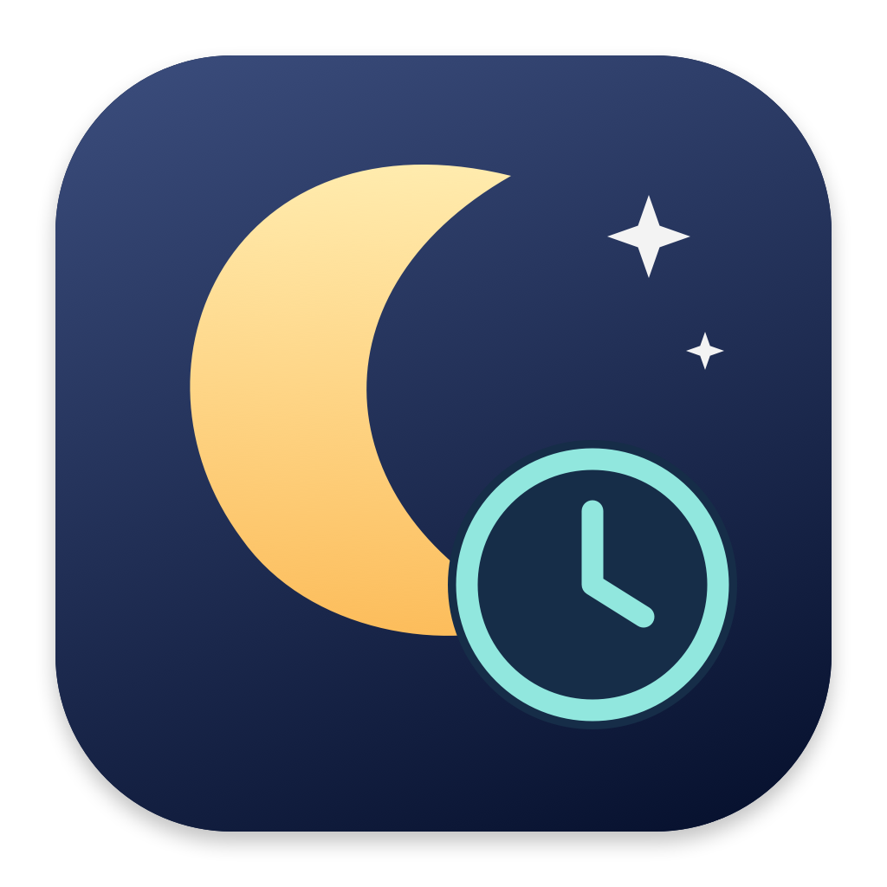

# Ajo Night Watcher



A compact native macOS menu-bar app that resumes a selected local Codex session after its usage limit resets. SwiftUI/AppKit interface, Python standard-library adapter, local JSON persistence. No Accessibility access, GUI clicking, web service, API key, or third-party packages.

## Start using it

Installed app: `~/Applications/Ajo Night Watcher.app`. Open it, or click the moon-and-stars icon in the menu bar and choose **Open task registry**.

1. Select a session from the registry. Chat names match Codex’s saved titles. A folder label shows the project when assigned. Search by chat name, project name, working directory, or session ID.
2. Enable **Automatically resume this task**. Discovery alone never enables a task.
3. When a saved Codex error contains an explicit reset timestamp, the watcher schedules the continuation. Otherwise enter the reset time shown by Codex and choose **Schedule continuation**. This also enables watching.
4. **Resume Now** sends the continuation immediately. Running tasks cannot be resumed again.
5. Use Settings to change the CLI path or continuation prompt.

Default prompt:

> Continue from where you stopped. Review the existing changes first and continue the original task.

The reset-time picker follows detected schedule updates automatically. Manual edits remain in place until you schedule them, switch chats, or choose **Use scheduled reset time**.

Scheduling starts roughly 15–30 seconds after the reset time. The Mac must be awake and logged in; after sleep, overdue schedules run on wake. Closing the registry window leaves the menu-bar app running. Quitting the app pauses scheduling; an already-started CLI worker continues. Reopen the app to catch up. Disabling auto-resume cancels automatic dispatch without deleting the recorded time.

Launch at login is installed on this Mac through `~/Library/LaunchAgents/com.ajo.night-watcher.plist`. launchd restarts the UI after a crash but respects normal Quit. Disable it with `./scripts/disable-login.sh` (this also stops the managed UI).

## Provider tabs and usage

The **Codex** tab watches local Codex sessions with account-wide usage cards. The **OpenCode** tab watches local OpenCode sessions across all models under the opencode provider (including Zen free models) at the session layer. Codex is the accurate name here: its account limits are separate from general ChatGPT chat limits.

Usage cards show **remaining** percentages and reset times for all windows returned by the signed-in Codex account. They refresh at startup, every two minutes while the app runs, and through their own refresh button. The adapter uses the documented read-only `account/rateLimits/read` method over a short-lived local Codex app-server process. It never starts an AI turn, purchases credits, or consumes a reset credit. No separate API key is needed.

Usage requests run separately from scheduling, with a bounded timeout. On failure, the last successful reading is labeled **Last known** with its timestamp and an error; missing values show **Unavailable**, not zero. Cache files are local and private. Changing the configured CLI path prevents reuse of the previous executable's cache. A changed account is reflected on the next successful refresh.

These are account-wide usage readings, not per-chat quotas. They are informational; the existing task-error detection and manual scheduling rules still determine which task resumes.

The OpenCode tab reads up to 300 unarchived sessions from `~/.local/share/opencode/opencode.db` over a read-only SQLite connection (session/message/project tables only; it never reads `auth.json`, `account.json`, or credentials). It derives Idle/Waiting/Needs Input/Completed from the latest recorded message per session. Zen exposes no account-wide quota endpoint, so rate-limit resets usually need manual entry; explicit timestamps in errors are honored when present. Headless continuation runs `opencode run -s SESSION_ID PROMPT` in the recorded directory; the CLI path defaults to `opencode` in `PATH` and is configurable in Settings. **Future:** the `opencode` CLI is not installed on this Mac yet, so resume is deferred — session monitoring works without it. Install later with `brew install anomalyco/tap/opencode` and smoke-test resume against a disposable session before relying on auto-resume.

The **Claude Code** tab watches local Claude Code transcripts in `~/.claude/projects/*/*.jsonl` (bounded reads only; it never touches settings, auth material, or credentials). Titles prefer the recorded `ai-title`, falling back to the first user message and then the working directory. Limit errors are detected from recorded text with explicit reset timestamps honored when present, otherwise manual entry. Headless continuation runs `claude -p --resume SESSION_ID PROMPT`; the CLI at `/usr/local/bin/claude` is used by default and is configurable in Settings.

## Build and install

Requires macOS 13+, Xcode Command Line Tools (`xcode-select --install`), `/usr/bin/python3`, and an authenticated Codex CLI. Built and verified on this Mac with Swift 6.2.3 and Codex CLI **0.153.4**. Builds for the host architecture; local ad-hoc signing, not notarized distribution.

```sh
cd ~/Repository/ajo-night-watcher
./scripts/build.sh
open 'dist/Ajo Night Watcher.app'

# Quit any running watcher before installing/updating:
./scripts/install.sh --login

# Tests use temporary data and a fake CLI; no account usage:
/usr/bin/python3 -m unittest discover -s tests -v
```

`./scripts/install.sh` without `--login` installs and opens the app without creating a login agent. It does not remove an existing login agent.

## Local architecture

- AppKit menu-bar item and a SwiftUI registry window. A 15-second timer and wake notification run scheduler checks on a background queue.
- `backend/watcher.py` reads up to 300 recent, unarchived root sessions from `$CODEX_HOME/state_5.sqlite` (default `~/.codex`). It resolves saved chat names and database project IDs, with Desktop project assignments and exact saved workspace roots as a legacy fallback; explicitly projectless chats stay projectless. Optional Desktop labels come from `.codex-global-state.json`. It uses a **read-only** SQLite connection and reads bounded tails of the referenced rollout JSONL files when changed. Repositories are taken from each session's `cwd`, including worktrees and projectless tasks. It does not enumerate `~/Repository` as a list of applications.
- Actual rate-limit errors plus explicit `resets_at`/`resetsAt` timestamps determine schedules. The latest token-count snapshot can supply reset times for windows with usage at or above 100%. Multiple exhausted windows use the latest reset. A usage snapshot alone never triggers continuation. Unknown/localized timestamps require manual entry; no guessed quota windows or retry polling.
- Persisted registry, arm flags, prompt, reset times, event history and per-session run logs live under `~/Library/Application Support/Ajo Night Watcher/`. Directory is private (0700), writes are atomic, and filesystem locks serialize changes. Interrupted workers go to Needs Input instead of being blindly retried.
- One detached worker runs at a time. It invokes a specific session ID through direct arguments, never through a shell:

```sh
codex -a never exec -s workspace-write resume --skip-git-repo-check --json SESSION_ID -
```

The prompt is sent through stdin. The process working directory is the recorded session directory. The app does not bypass the sandbox or approvals; noninteractive runs cannot obtain interactive permission. `workspace-write` permits normal task edits within the working directory. Project configuration, installed integrations, authentication, and Codex behavior still apply.

Notifications are requested for resume and finish/failure events; allow them in macOS System Settings → Notifications. The registry and logs remain usable if notifications are denied.

## States

| State | Meaning |
|---|---|
| Running | A saved turn-start event has no later terminal event, or a watcher worker is active. |
| Waiting | A rate-limit reset or manually entered reset has been recorded. Runs automatically only while watching is enabled. |
| Idle | No active/terminal event is available, or you explicitly marked a stopped session idle. |
| Needs Input | Missing reset, aborted/interrupted run, unavailable history, or execution failure requiring review. |
| Completed | The latest Codex **turn** completed; this does not prove the original project or goal is fully done. |

If Codex crashed and a session still says Running, first establish that the task has stopped in Codex, then use **Mark idle after stopping in Codex**. Do not run the same session in another client while the watcher resumes it. The watcher blocks observed active tasks and observed other tasks in the same working directory, but the local files are not an atomic cross-client execution lock.

## Codex findings and MVP limitations

- Installed executable is `/Applications/ChatGPT.app/Contents/Resources/codex`, version 0.153.4. Settings allow changing the path after an app update or CLI installation. Existing Codex authentication is reused; the watcher never reads or copies `auth.json`.
- Desktop root sessions are present in the same `~/.codex/state_5.sqlite` database with IDs, working directories and rollout paths. Recent Desktop sessions use `history_mode=paginated`; use Codex's own resume command to reconstruct history rather than assembling it ourselves.
- **Live smoke test passed:** a disposable CLI session replied `AJO_READY`, then `exec resume` returned the identical thread ID and `AJO_READY RESUMED` when asked to recall its earlier response. No existing user project was resumed or changed for this test. A separate read-only app-server `thread/read` check loaded this Desktop task’s paginated history (2 turns), confirming it is accessible to the installed CLI service. The actual in-app scheduler also resumed the disposable session and received `AJO_WATCHER_OK`; its saved context confirmed `workspace-write`, network disabled, and approval policy `never`.
- Local Desktop history is discoverable, but no guarantee is made that every Desktop-only tool, cloud task, approval flow, model setting, or connected host transfers to a headless CLI invocation. Cloud and remote-only tasks are outside this MVP. Opening a desktop window is not necessary for CLI execution; live Desktop UI refresh behavior is not part of the guarantee.
- Codex does not expose a stable `status --json` command here. `codex queue`, `codex agents` and experimental app-server commands also exist; this MVP uses the tested `exec resume` command and its terminal event stream. Internal SQLite/rollout schemas may change. Missing schemas fail closed and show an error.
- Recent local quota events contain actual epoch reset times, but **no real rate-limit error was found in the inspected recent history**. Automatic error detection is fixture-tested, not validated against a real exhausted account. Some Desktop errors are not persisted. For those, manual reset recording is the dependable fallback.
- Only protocol errors are parsed for limits; user messages, assistant text and command output are not treated as scheduling instructions. Human-readable dates such as “Sep 9, 4:00 AM” are deliberately not guessed.
- A successful CLI turn can still contain a natural-language question. There is no stable semantic “whole task completed” flag in `exec` output. Review the final response in the run log; Completed means turn completion only.
- The worker never blindly retries an expired reset or an unknown error. It asks for input through the registry and notification instead. Automatic resume does not mean unlimited autonomous continuation after every successful turn.
- Recent-session list is capped at 300, and history parsing reads the final 2 MiB. Older tracked sessions outside the current discovery window remain listed but become unavailable. No legacy fallback silently rewrites Codex storage.

Official reference: [Codex non-interactive mode and session resume](https://learn.chatgpt.com/docs/non-interactive-mode). Installed CLI help and read-only local inspection are the authority for version-specific details above.

## Future work

- OpenCode resume depends on the `opencode` CLI, which is not installed here yet (`brew install anomalyco/tap/opencode`). Monitoring works without it.
- Headless resume for OpenCode (`opencode run -s`) and Claude Code (`claude -p --resume`) is implemented but not yet smoke-tested against disposable sessions. Auto-resume should not be relied on until those probes pass.

## Files and removal

Source stays in `~/Repository/ajo-night-watcher`. Generated build and development test records are ignored by Git. No telemetry is sent by the watcher; resumed Codex runs use your normal Codex account and usage.

To uninstall, run `./scripts/disable-login.sh`, quit the app, and remove `~/Applications/Ajo Night Watcher.app`. You can retain the Application Support folder for later use or remove it separately to delete watcher settings and logs. Codex's own sessions are never deleted by this app.

## App icon

Original crescent-moon and clock artwork is included in `assets/`. Regenerate its PNG and macOS ICNS with `./scripts/make-icon.sh`; the build script embeds it in the app. The menu bar uses a monochrome moon-and-stars symbol.
